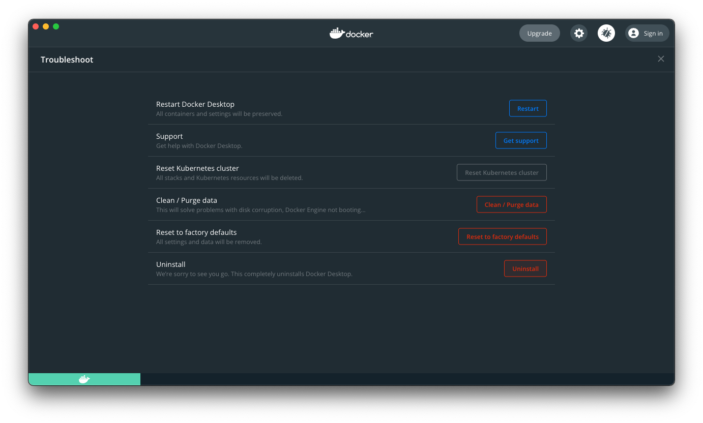

# Migrate from Docker Desktop to Multipass

This document will guide you from your current installation of Docker Desktop for Mac to a setup which is not burdened by license fees.

## Reasoning

TODO

## Let’s do this

### Remove Docker Desktop for Mac

**Warning**: prior to removing Docker Desktop for Mac, please make sure you back up all the important data you might be storing in your containers/volumes.

1. Click the Docker icon in the macOS menu bar
2. Select the _Settings_ option
3. Click the button with a bug icon in the top right
   
4. Click the _Uninstall_ button and confirm the removal
   
   
   
   - This will make sure that all files that were created by Docker Desktop (such as Docker images, Docker containers, and the Linux VM in which Docker Desktop operates itself) are properly removed
   - This process might take 5-15 minutes, because Docker for Mac never cared about your time as a developer
5. If you installed Docker Desktop for Mac using Homebrew (specifically Homebrew Cask), also remove the last remaining artifacts of Docker Desktop by running either `brew uninstall --cask docker` or `brew uninstall --cask docker-edge`

### Install Multipass

1. In shell, run `brew install multipass`
2. You will be prompted for your password during the installation, so enter it when prompted
3. _Optional_: if you want to (or have to, due to crazy network configuration, as is the case for me) use VirtualBox as the hypervisor (instead of `Hypervisor.framework`), install VirtualBox now using the following command: `brew install virtualbox`
   - You will likely be prompted to enable new kernel extension. You can do so by going to _System Preferences_ ⤳ _Security and Privacy_ ⤳ _Allow_, and restarting your Mac
   - An indication that you cannot use `Hypervisor.framework` would be a sudden loss of Internet connection on your Mac while running the `init-instance.sh` command in the next step. If that happens to you, don’t panic, and restart your Mac. That should restore your network functionality. Run the `multipass delete --purge --all` command to start again from a clean state, and resume this tutorial from the third step, by using VirtualBox this time
4. Provision a virtual machine using Multipass:
   - If using the default `Hypervisor.framework`, run `./init-instance.sh docker`
   - If using VirtualBox, run `./init-instance.sh docker --virtualbox`
